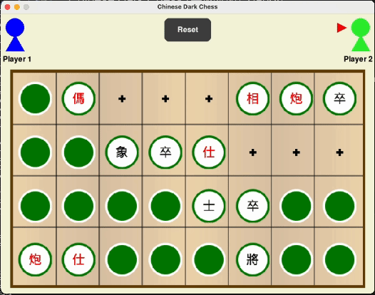

# Chinese Dark Chess (中國暗棋, Banqi)
This is a Chinese Dark Chess game implemented in Python pygame, following normal Taiwanese rules of the game. Detailed rules can be found on [Wikipedia](https://en.wikipedia.org/wiki/Banqi).

<!--  -->


- **Features**
  - Single Player Game: Supports one-on-one single player mode.
  - AI Combat: Engages in battles using an AI trained via the Alpha Zero method, which is still in the extremely early stages of development and requires further performance improvements.
- **Development Environment**
  - Python Version: Python 3.10
  - Dependency Management: Uses pipenv for Python package management.
  - Code Inspection: Uses mypy for static type checking.

- **Getting Started**
  - First, clone the repository, then install dependencies and run the game:
  ```bash
  git clone <Repository URL>
  cd chinese-dark-chess
  pipenv install
  pipenv run python main.py
  ```


- **Makefile Usage**
  - This project includes a Makefile to facilitate the management and execution of common tasks:
    - make install: Installs all dependencies.
    - make run: Runs the game. AI mode can be enabled by adding the AI=1 parameter, such as `make run AI=1`.
    - make clean: Cleans the project, including removing the virtual environment and cache files.
    - make test: Runs tests.


- **Additional Information**
  - Board Details: As the game board is loaded from images, alignment of the grids may be inaccurate, and the visual effects are relatively simple, lacking animation.
  - Scripts folder: Contains some utility tools and helper scripts, which are relatively independent of the main project.

- **AI Training and Performance**
  - The AI employs the AlphaZero algorithm for training. Since the encoding of the game state still requires significant improvement. The current AI performance is far from adequate ,often resembling random gameplay.
  - The construction of the neural network and the training process referenced the following resources, which include code and some algorithm introductions:
    - [Alpha-Zero Papper](https://arxiv.org/pdf/1712.01815.pdf)
    - [GitHub - foersterrobert/AlphaZeroFromScratch](https://github.com/foersterrobert/AlphaZeroFromScratch?tab=readme-ov-file)
    - [AlphaZero from Scratch – Machine Learning Tutorial - YouTube](https://www.youtube.com/watch?v=wuSQpLinRB4)
    - [Monte Carlo Tree Search (MCTS) algorithm for dummies! | by michelangelo | Medium](https://medium.com/@_michelangelo_/monte-carlo-tree-search-mcts-algorithm-for-dummies-74b2bae53bfa)
    - [(深度學習)ResNet之殘差學習. 以下我想要分享我學習什麼是Resnet的一些心得。 | by Ben Hu | Medium](https://medium.com/@hupinwei/%E6%B7%B1%E5%BA%A6%E5%AD%B8%E7%BF%92-resnet%E4%B9%8B%E6%AE%98%E5%B7%AE%E5%AD%B8%E7%BF%92-f3ac36701b2f)
    - [AlphaZero 之加速演算法實作 - HackMD](https://hackmd.io/@yrHb-fKBRoyrKDEKdPSDWg/HJI9_p70i)


- **Tasks to Be Completed**
  - [ ]  AI Performance Improvement: The AI is still at an elementary level; improvements are needed in action encoding and game state transitions.
  - [ ] Reduce Coupling Between the AI Module and Game Logic.
  - [ ] Increase Test Coverage.
  - [ ] Enhance Exception and Log Handling.
  - [ ] Future Features: Consider adding online multiplayer functionality.
